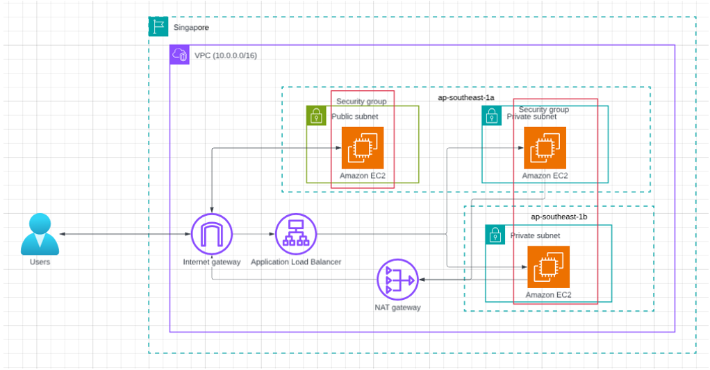
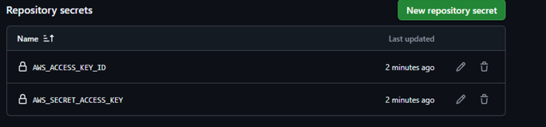
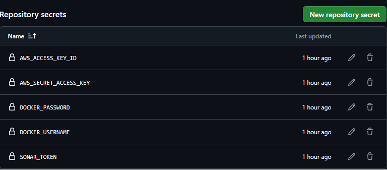

# Báo Cáo Thực Hành: DevSecOps 3-Tier Architecture với Docker Swarm, Terraform & CloudFormation
**Sinh viên thực hiện:** Nguyễn Lê Nhật Đăng - 2352031; Trần Hải Đăng - 23520237; Phan Hồng Đạt - 23520266
**Môn học:** NT548 - Công nghệ DevOps và ứng dụng
## 1. Giới thiệu 
Lab này triển khai một Voting App - một microservice mẫu của cộng đồng docker. Hệ thống được tự động hóa bằng **Terraform** và có thêm phương án triển khai tương đương bằng **AWS CloudFormation nested stacks**. Ứng dụng chạy trên **Docker Swarm** để thiết lập mạng Overlay và triển khai các service Vote, Result, Worker, Redis, PostgreSQL.

### Kiến trúc hệ thống

- **Frontend/Web Tier**: Vote App (Python) và Result App (Node.js).
- **App Tier**: Worker (C# / .NET) xử lý hàng đợi.
- **Database Tier**: Redis (In-memory queue) và PostgreSQL (Database).
- **Cơ sở hạ tầng**:
  - Mạng: AWS VPC (Public & Private Subnets), NAT Gateway.
  - Cân bằng tải: AWS Application Load Balancer (ALB).
  - Máy chủ: 2 EC2 instances chạy trong Private Subnets, được nhóm thành **Docker Swarm Cluster**. Máy Manager quản lý stateful (DB, Redis), các máy Worker xử lý luồng Web.
- **Bảo mật**: Quét cấu hình bằng Checkov, quét chất lượng code bằng SonarQube, truy cập EC2 an toàn qua AWS Systems Manager (SSM) Session Manager thay vì mở cổng SSH (port 22) ra internet.
---

## 2. Yêu cầu môi trường
Trước khi triển khai hạ tầng cần chuẩn bị:
1. **Tài khoản AWS**: Có quyền AdministratorAccess (để tạo VPC, EC2, ALB, IAM, S3, DynamoDB).
2. **AWS CLI**: Đã cài đặt và cấu hình credentials (`aws configure`).
3. **Terraform**: Phiên bản `>= 1.3.0` nếu triển khai bằng Terraform.
4. **Tài khoản GitHub**: Để fork repo mã nguồn và chạy GitHub Actions.
5. **Tài khoản Docker Hub**: Để lưu trữ các Docker Image được build từ CI/CD.
6. **CloudFormation tools**: `cfn-lint` nếu kiểm tra template CloudFormation local.
7. **AWS CodeCommit access**: Git có thể push lên CodeCommit bằng AWS credential helper.
---
Thiết lập AWS secret:
Tạo một IAM role mới và tạo access token cho third-party service sau đó nhập vào Github secret.


Trong repo của Microservice: [Đường dẫn tới repo Voting App](https://github.com/DangTH27/example-voting-app.git)


Thêm IAM role tương tự.
Tạo token từ DockerHub và [SonarCloud](https://sonarcloud.io/explore/projects) sau đó thêm vào secret.
## 3. Hướng dẫn Triển khai bằng Terraform
### Bước 1: Khởi tạo Nền móng (Bootstrap S3 Backend)
Để quản lý file state của Terraform một cách an toàn, cần khởi tạo S3 bucket trước. Chỉ cần thực hiện thao tác này 1 lần vì các lần sau terraform sẽ tự đối chiếu đến file state trong S3.

```bash
cd terraform/bootstrap
terraform init
terraform apply -auto-approve
```
Sau đó chỉ cần commit code để kích hoạt pipeline tự động hóa quá trình deploy lên AWS hoặc sử dụng các lệnh thủ công bên dưới:
### Bước 2: Triển khai Hạ tầng mạng và Máy chủ (Terraform)
Tiếp theo, tiến hành tạo VPC, ALB, IAM Roles và khởi động Docker Swarm trên EC2 qua User Data.

```bash
# Quay lại thư mục gốc dự án Terraform
cd ..
# Khởi tạo Terraform với S3 Backend
terraform init
# Quét lỗi bảo mật trong mã IaC (DevSecOps)
checkov -d . --soft-fail
# Triển khai hạ tầng
terraform apply -auto-approve
```
Khi quá trình hoàn tất, Terraform sẽ in ra màn hình `vote_url` (cổng 80) và `result_url` (cổng 8081) của hệ thống Load Balancer.
---

## 4. Hướng dẫn Triển khai bằng CloudFormation và CodePipeline

Phần CloudFormation nằm trong thư mục `CloudFormation/` và được tổ chức theo nested stacks. Repo cũng có thêm template riêng để tạo pipeline CI/CD cho CloudFormation.

```text
CloudFormation/
├── main.yaml
├── pipeline.yaml
├── packaged.yaml
├── buildspec-cfn.yml
├── .taskcat.yml
├── parameters/
│   ├── dev.json
│   └── dev-pipeline.json
└── nested/
    ├── network.yaml
    ├── security-groups.yaml
    ├── iam.yaml
    ├── alb.yaml
    ├── compute.yaml
    └── bastion.yaml
```

### 4.1. Ý nghĩa các file CI/CD CloudFormation

```text
CloudFormation/main.yaml
```

Template gốc triển khai hạ tầng Voting App gồm VPC, public/private subnets, NAT Gateway, Security Groups, IAM, EC2, Bastion và ALB.

```text
CloudFormation/pipeline.yaml
```

Template tạo hệ thống CI/CD gồm CodeCommit, CodeBuild, CodePipeline, S3 artifact buckets, IAM roles và EventBridge trigger.

```text
CloudFormation/buildspec-cfn.yml
```

Kịch bản cho CodeBuild. File này cài `cfn-lint` và `taskcat`, chạy kiểm tra template, package nested stacks lên S3, validate template đã package và xuất artifact cho CodePipeline deploy.

```text
CloudFormation/parameters/dev-pipeline.json
```

Parameter file dùng riêng cho CodePipeline CloudFormation deploy action. Format này khác `dev.json` của AWS CLI vì CodePipeline cần dạng:

```json
{
  "Parameters": {
    "ProjectName": "nhom6-voting-cfn"
  },
  "Tags": {
    "Environment": "dev"
  }
}
```

### 4.2. Cấu hình hiện tại

```text
AWS Account: 275057777292
Region: ap-southeast-1
Pipeline stack: voting-app-cfn-pipeline
Application stack: nhom6-voting-cfn-dev
Project name: nhom6-voting-cfn
CodeCommit repository: voting-app-cfn-source
CodePipeline: nhom6-voting-cfn-dev-cfn-pipeline
CodeBuild project: nhom6-voting-cfn-dev-cfn-build
Pipeline artifact bucket: nhom6-codepipeline-artifacts-275057777292-ap-southeast-1
CloudFormation artifact bucket: nhom6-cfn-artifacts-275057777292-ap-southeast-1
EC2 key pair name: nhom6-cfn-voting-app
Local private key path: C:\Users\hogda\nhom6-cfn-voting-app.pem
Allowed SSH CIDR: 1.52.34.147/32
Voting app repo: https://github.com/DangTH27/example-voting-app.git
Voting app stack file: docker-stack.yml
```

Kiểm tra AWS CLI đang đúng account và region:

```powershell
aws sts get-caller-identity
aws configure list
```

Kỳ vọng account là:

```text
275057777292
```

Nếu vào AWS Console không thấy tài nguyên, kiểm tra lại Console đang ở đúng account `275057777292` và region `Asia Pacific (Singapore) ap-southeast-1`.

### 4.3. Chuẩn bị EC2 key pair

CloudFormation không dùng đường dẫn file `.pem`; template cần tên EC2 key pair đã tồn tại trên AWS.

Kiểm tra key pair:

```powershell
aws ec2 describe-key-pairs `
  --key-names nhom6-cfn-voting-app `
  --region ap-southeast-1
```

Nếu chỉ có file private key local và chưa có key pair trên AWS, import public key từ file `.pem`:

```powershell
$pem = "C:\Users\hogda\nhom6-cfn-voting-app.pem"
$pub = Join-Path $env:TEMP "nhom6-cfn-voting-app.pub"
ssh-keygen -y -f $pem | Set-Content -LiteralPath $pub -NoNewline -Encoding ascii

aws ec2 import-key-pair `
  --key-name nhom6-cfn-voting-app `
  --public-key-material "fileb://$pub" `
  --region ap-southeast-1
```

Không commit file `.pem` vào repository.

### 4.4. Validate template trước khi deploy

Chạy tại thư mục gốc repo:

```powershell
aws cloudformation validate-template `
  --template-body file://CloudFormation/pipeline.yaml `
  --region ap-southeast-1
```

```powershell
aws cloudformation validate-template `
  --template-body file://CloudFormation/main.yaml `
  --region ap-southeast-1
```

Kiểm tra JSON parameter của pipeline:

```powershell
Get-Content CloudFormation\parameters\dev-pipeline.json -Raw | ConvertFrom-Json
```

Nếu có `cfn-lint` local, có thể kiểm tra thêm:

```powershell
cfn-lint -i W3002 -- CloudFormation/main.yaml CloudFormation/pipeline.yaml CloudFormation/nested/*.yaml
```

### 4.5. Deploy pipeline stack

Lệnh này tạo hệ thống CI/CD trên AWS. Sau khi stack này chạy xong, việc deploy hạ tầng app sẽ được điều phối bằng CodePipeline.

```powershell
aws cloudformation deploy `
  --template-file CloudFormation/pipeline.yaml `
  --stack-name voting-app-cfn-pipeline `
  --capabilities CAPABILITY_NAMED_IAM `
  --region ap-southeast-1 `
  --parameter-overrides `
    ProjectName=nhom6-voting-cfn `
    Environment=dev `
    RepositoryName=voting-app-cfn-source `
    BranchName=main `
    PipelineArtifactBucketName=nhom6-codepipeline-artifacts-275057777292-ap-southeast-1 `
    CfnArtifactBucketName=nhom6-cfn-artifacts-275057777292-ap-southeast-1 `
    TargetStackName=nhom6-voting-cfn-dev `
    CreateCodeCommitRepository=true `
    CreateArtifactBuckets=true `
    RunTaskcat=false `
    AttachTaskcatLabPermissions=false
```

Kiểm tra output của pipeline stack:

```powershell
aws cloudformation describe-stacks `
  --stack-name voting-app-cfn-pipeline `
  --region ap-southeast-1 `
  --query "Stacks[0].Outputs"
```

### 4.6. Push source lên CodeCommit để kích hoạt pipeline

Pipeline lấy source từ CodeCommit, không lấy trực tiếp từ GitHub.

Cấu hình remote CodeCommit:

```bash
git remote set-url codecommit https://git-codecommit.ap-southeast-1.amazonaws.com/v1/repos/voting-app-cfn-source
```

Nếu chưa có remote `codecommit`, dùng:

```bash
git remote add codecommit https://git-codecommit.ap-southeast-1.amazonaws.com/v1/repos/voting-app-cfn-source
```

Cấu hình Git dùng AWS CodeCommit credential helper:

```bash
git config credential.helper ""
git config --add credential.helper '!aws codecommit credential-helper $@'
git config credential.UseHttpPath true
```

Push source:

```bash
git add .
git commit -m "update cloudformation pipeline"
git push codecommit main
```

Mỗi lần push lên nhánh `main` của CodeCommit, EventBridge sẽ tự kích hoạt CodePipeline.

### 4.7. Theo dõi CodePipeline

Kiểm tra trạng thái pipeline:

```powershell
aws codepipeline get-pipeline-state `
  --name nhom6-voting-cfn-dev-cfn-pipeline `
  --region ap-southeast-1
```

Pipeline phải có 3 stage chính:

```text
Source -> BuildAndValidate -> Deploy
```

Kỳ vọng:

```text
Source: Succeeded
BuildAndValidate: Succeeded
Deploy: Succeeded
```

Xem lịch sử execution:

```powershell
aws codepipeline list-pipeline-executions `
  --pipeline-name nhom6-voting-cfn-dev-cfn-pipeline `
  --region ap-southeast-1 `
  --max-results 5
```

### 4.8. Theo dõi CodeBuild

CodeBuild chạy các bước CI cho CloudFormation:

```text
pip install cfn-lint taskcat
cfn-lint
aws cloudformation package
aws cloudformation validate-template
upload packaged.yaml and dev-pipeline.json
```

Lấy build mới nhất:

```powershell
aws codebuild list-builds-for-project `
  --project-name nhom6-voting-cfn-dev-cfn-build `
  --region ap-southeast-1 `
  --sort-order DESCENDING
```

Xem chi tiết build:

```powershell
aws codebuild batch-get-builds `
  --ids <BuildId> `
  --region ap-southeast-1
```

Trên AWS Console, vào:

```text
CodeBuild -> Build projects -> nhom6-voting-cfn-dev-cfn-build -> Build history -> Logs
```

### 4.9. Theo dõi CloudFormation app stack

Application stack được pipeline deploy là:

```text
nhom6-voting-cfn-dev
```

Kiểm tra status và outputs:

```powershell
aws cloudformation describe-stacks `
  --stack-name nhom6-voting-cfn-dev `
  --region ap-southeast-1 `
  --query "Stacks[0].{Status:StackStatus,Outputs:Outputs}"
```

Kỳ vọng:

```text
CREATE_COMPLETE hoặc UPDATE_COMPLETE
```

Xem events nếu stack đang chạy hoặc bị lỗi:

```powershell
aws cloudformation describe-stack-events `
  --stack-name nhom6-voting-cfn-dev `
  --region ap-southeast-1 `
  --max-items 30
```

### 4.10. Kiểm tra app sau khi deploy

Lấy output URL:

```powershell
aws cloudformation describe-stacks `
  --stack-name nhom6-voting-cfn-dev `
  --region ap-southeast-1 `
  --query "Stacks[0].Outputs"
```

Kiểm tra Vote và Result:

```powershell
Invoke-WebRequest `
  -Uri "<VoteUrl>" `
  -UseBasicParsing
```

```powershell
Invoke-WebRequest `
  -Uri "<ResultUrl>" `
  -UseBasicParsing
```

Kỳ vọng HTTP status:

```text
200
```

Kiểm tra EC2 app nodes:

```powershell
aws ec2 describe-instances `
  --region ap-southeast-1 `
  --query "Reservations[*].Instances[*].{Id:InstanceId,State:State.Name,PrivateIp:PrivateIpAddress,PublicIp:PublicIpAddress,Name:Tags[?Key=='Name']|[0].Value}"
```

Kỳ vọng:

```text
App EC2 instances running, có private IP, không có public IP.
Bastion có public IP nếu EnableBastion=true.
```

Kiểm tra SSM:

```powershell
aws ssm describe-instance-information `
  --region ap-southeast-1
```

Kiểm tra target groups healthy:

```powershell
$tgs = aws elbv2 describe-target-groups `
  --region ap-southeast-1 `
  --query "TargetGroups[?contains(TargetGroupName, 'nhom6')].TargetGroupArn" `
  --output text

foreach ($tg in $tgs -split "\s+") {
  if ($tg) {
    aws elbv2 describe-target-health `
      --target-group-arn $tg `
      --region ap-southeast-1 `
      --query "TargetHealthDescriptions[].{Target:Target.Id,Port:Target.Port,State:TargetHealth.State}" `
      --output table
  }
}
```

### 4.11. Kiểm tra trực quan trên AWS Console

Chọn đúng account `275057777292` và region `ap-southeast-1`, sau đó kiểm tra:

```text
CodePipeline -> nhom6-voting-cfn-dev-cfn-pipeline
CodeBuild -> nhom6-voting-cfn-dev-cfn-build -> Build history
CloudFormation -> nhom6-voting-cfn-dev
EC2 -> Instances
EC2 -> Target Groups
EC2 -> Load Balancers
```

Ảnh nên chụp cho báo cáo:

```text
CodeCommit có source code.
CodePipeline 3 stage đều Succeeded.
CodeBuild log có cfn-lint, package, validate-template.
CloudFormation stack CREATE_COMPLETE hoặc UPDATE_COMPLETE.
ALB target groups healthy.
VoteUrl và ResultUrl truy cập được.
```

### 4.12. Taskcat trong pipeline

`Taskcat` đã được tích hợp trong `buildspec-cfn.yml`, nhưng mặc định:

```text
RunTaskcat=false
```

Lý do: Taskcat có thể tạo stack test thật và phát sinh chi phí. Khi cần demo live Taskcat, deploy lại pipeline với:

```powershell
RunTaskcat=true `
AttachTaskcatLabPermissions=true
```

Sau đó push lại source lên CodeCommit để pipeline chạy. Chỉ bật khi thật sự cần test deploy live.

### 4.13. SSH và SSM

Ưu tiên dùng SSM Session Manager cho EC2 app nodes:

```powershell
aws ssm start-session `
  --target <InstanceId> `
  --region ap-southeast-1
```

SSH vào bastion nếu cần:

```powershell
ssh -i "C:\Users\hogda\nhom6-cfn-voting-app.pem" ec2-user@<BastionPublicIp>
```

SSH vào private EC2 qua bastion:

```powershell
ssh -i "C:\Users\hogda\nhom6-cfn-voting-app.pem" `
  -J ec2-user@<BastionPublicIp> `
  ec2-user@<PrivateInstanceIp>
```

Không copy file `.pem` lên bastion.

---

## 5. Cấu hình GitHub Secrets cho CI/CD ứng dụng
Trên GitHub Repository của Ứng dụng (Voting App), truy cập **Settings > Secrets and variables > Actions**, thêm các biến sau:
- `AWS_ACCESS_KEY_ID`: Khóa truy cập AWS.
- `AWS_SECRET_ACCESS_KEY`: Khóa bí mật AWS.
- `DOCKER_USERNAME`: Tên đăng nhập Docker Hub.
- `DOCKER_PASSWORD`: Mật khẩu hoặc Access Token Docker Hub.
- `SONAR_TOKEN`: Token của SonarCloud (dùng cho luồng quét Code Quality).

### Bước 4: Chạy CI/CD Pipeline ứng dụng
- Thực hiện Commit và Push code lên nhánh `main` của repo Voting App.
- GitHub Actions sẽ tự động kích hoạt Pipeline với 2 luồng chính:
  1. Quét chất lượng code bằng SonarCloud.
  2. Build 3 Docker Images (Vote, Result, Worker) và Push lên Docker Hub.
  3. Gửi lệnh qua AWS SSM đến máy EC2 (Swarm Manager) để tự động tải Image mới và cập nhật các dịch vụ đang chạy bằng lệnh `docker service update`.

Lưu ý: phần này là pipeline ứng dụng. Pipeline CloudFormation trong mục 4 là pipeline hạ tầng, lấy source từ CodeCommit và deploy stack bằng CloudFormation.

---

## 6. Hướng dẫn Kiểm tra và Đánh giá

1. **Kiểm tra luồng người dùng (User Flow)**:
   - Truy cập vào đường link `vote_url` (ví dụ: `http://<ALB-DNS>:80`). Nhấn bình chọn cho một tùy chọn (ví dụ: Monday vs Sunday).
   - Truy cập vào đường link `result_url` (ví dụ: `http://<ALB-DNS>:8081`). Hệ thống sẽ ngay lập tức cập nhật phần trăm bình chọn nhờ kết nối WebSockets của Socket.IO.
   - Dù lượt bình chọn rơi vào EC2 số 2, mạng Overlay của Docker Swarm sẽ định tuyến gói tin đâm xuyên về vùng chứa Database ở máy EC2 số 1, đảm bảo tính nhất quán dữ liệu.

2. **Kiểm tra CI/CD CloudFormation bằng CodePipeline**:
   - Sửa một thay đổi nhỏ trong `CloudFormation/parameters/dev-pipeline.json`, ví dụ đổi tag `ManagedBy`.
   - Commit và push lên CodeCommit:

```bash
git add CloudFormation/parameters/dev-pipeline.json
git commit -m "demo cloudformation pipeline trigger"
git push codecommit main
```

   - Mở AWS Console tại `ap-southeast-1`:

```text
CodePipeline -> nhom6-voting-cfn-dev-cfn-pipeline
```

   - Kỳ vọng pipeline tự chạy và cả 3 stage đều thành công:

```text
Source: Succeeded
BuildAndValidate: Succeeded
Deploy: Succeeded
```

   - Đây là bằng chứng CI/CD cho CloudFormation:

```text
CI: CodeBuild chạy cfn-lint, package, validate-template.
CD: CodePipeline gọi CloudFormation deploy action để update stack.
```

3. **Kiểm tra CI/CD ứng dụng nếu pipeline ứng dụng được cấu hình riêng**:
   - Sửa một file giao diện bất kỳ tại repo example-voting-app (Ví dụ: `vote/app.py`).
   - Push lên nhánh `main`.
   - Chờ Pipeline chạy xong, truy cập lại trang Web. Giao diện sẽ tự động cập nhật phiên bản mới mà **không gây thời gian chết (Zero Downtime)** nhờ cơ chế Rolling Update của Docker Swarm. Không yêu cầu bất kỳ thao tác thủ công nào trên máy chủ.

4. **Kiểm tra CloudFormation stack**:

```powershell
aws cloudformation describe-stacks `
  --stack-name nhom6-voting-cfn-dev `
  --region ap-southeast-1 `
  --query "Stacks[0].StackStatus"
```

Kỳ vọng:

```text
CREATE_COMPLETE hoặc UPDATE_COMPLETE
```

5. **Kiểm tra VPC, subnet, route table và NAT Gateway**:

```powershell
aws ec2 describe-vpcs `
  --filters "Name=tag:Project,Values=nhom6-voting-cfn" `
  --region ap-southeast-1 `
  --output table
```

```powershell
aws ec2 describe-subnets `
  --filters "Name=tag:Project,Values=nhom6-voting-cfn" `
  --region ap-southeast-1 `
  --query "Subnets[].{SubnetId:SubnetId,Cidr:CidrBlock,Az:AvailabilityZone,MapPublicIp:MapPublicIpOnLaunch,Tier:Tags[?Key=='Tier']|[0].Value}" `
  --output table
```

```powershell
aws ec2 describe-route-tables `
  --filters "Name=vpc-id,Values=<VpcId>" `
  --region ap-southeast-1 `
  --output table
```

```powershell
aws ec2 describe-nat-gateways `
  --filter "Name=vpc-id,Values=<VpcId>" `
  --region ap-southeast-1 `
  --output table
```

6. **Kiểm tra EC2 public/private**:

```powershell
aws ec2 describe-instances `
  --filters "Name=tag:Project,Values=nhom6-voting-cfn" `
  --region ap-southeast-1 `
  --query "Reservations[].Instances[].{Id:InstanceId,Name:Tags[?Key=='Name']|[0].Value,PrivateIp:PrivateIpAddress,PublicIp:PublicIpAddress,State:State.Name,Subnet:SubnetId,Type:InstanceType}" `
  --output table
```

Kỳ vọng:

```text
Bastion có public IP.
EC2 app nodes nằm private subnet và không có public IP.
```

7. **Kiểm tra ALB target health**:

```powershell
$tgs = aws elbv2 describe-target-groups `
  --region ap-southeast-1 `
  --query "TargetGroups[?VpcId=='<VpcId>'].TargetGroupArn" `
  --output text

foreach ($tg in $tgs -split "\s+") {
  if ($tg) {
    aws elbv2 describe-target-health `
      --target-group-arn $tg `
      --region ap-southeast-1 `
      --query "TargetHealthDescriptions[].{Target:Target.Id,Port:Target.Port,State:TargetHealth.State}" `
      --output table
  }
}
```

Kỳ vọng:

```text
Các target port 8080 và 8081 đều healthy.
```

8. **Kiểm tra Vote và Result URL**:

```powershell
Invoke-WebRequest `
  -Uri "<VoteUrl>" `
  -UseBasicParsing
```

```powershell
Invoke-WebRequest `
  -Uri "<ResultUrl>" `
  -UseBasicParsing
```

Kỳ vọng:

```text
HTTP StatusCode = 200
```

---

## 7. Dọn dẹp Tài nguyên

### Dọn dẹp Terraform

Để tránh phát sinh chi phí AWS sau khi chấm bài, vui lòng chạy lệnh sau tại thư mục gốc của dự án Terraform:

```bash
cd terraform
terraform destroy -auto-approve
```
*(Lưu ý: Lệnh này sẽ tự động thu hồi toàn bộ VPC, ALB và EC2. Nó không xóa S3 Bucket trong thư mục `bootstrap` nhằm bảo vệ File State, tránh các lỗi khi chạy lại vào lần sau).*

### Dọn dẹp CloudFormation

Chỉ chạy khi muốn xóa hạ tầng ứng dụng CloudFormation:

```powershell
aws cloudformation delete-stack `
  --stack-name nhom6-voting-cfn-dev `
  --region ap-southeast-1
```

Theo dõi quá trình xóa:

```powershell
aws cloudformation wait stack-delete-complete `
  --stack-name nhom6-voting-cfn-dev `
  --region ap-southeast-1
```

Nếu muốn xóa luôn hệ thống CI/CD CloudFormation:

```powershell
aws cloudformation delete-stack `
  --stack-name voting-app-cfn-pipeline `
  --region ap-southeast-1
```

Theo dõi quá trình xóa pipeline stack:

```powershell
aws cloudformation wait stack-delete-complete `
  --stack-name voting-app-cfn-pipeline `
  --region ap-southeast-1
```

Lưu ý: các S3 artifact buckets đang có `DeletionPolicy: Retain`, nên có thể vẫn còn sau khi xóa pipeline stack. Nếu muốn xóa bucket, cần empty bucket trước rồi xóa thủ công.

Lưu ý chi phí: NAT Gateway, ALB, EC2, Elastic IP, S3 artifact bucket, CodeBuild và CodePipeline có thể phát sinh phí nếu để chạy lâu.

---
